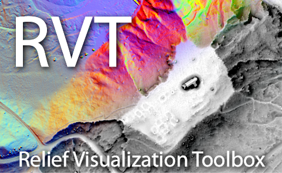

# Relief Visualization Toolbox Python library

Relief Visualization Toolbox (RVT) was produced to help scientists visualize raster elevation model datasets. We have narrowed down the selection to include techniques that have proven to be effective for identification of small scale features. The default settings therefore assume working with high resolution digital elevation models derived from airborne laser scanning missions (lidar), however RVT methods can also be used for other purposes.

Sky-view factor, for example, can be efficiently used in numerous studies where digital elevation model visualizations and automatic feature extraction techniques are indispensable, e.g. in geography, archaeology,  geomorphology, cartography, hydrology, glaciology, forestry and disaster management. It can even be used in engineering applications, such as predicting the availability of the GPS signal in urban areas.

Methods currently implemented are:

* hillshading,
* hillshading from multiple directions,
* slope gradient,
* simple local relief model,
* multi-scale relief model,
* sky illumination,
* sky-view factor (as developed by our team),
* anisotropic sky-view factor,
* positive and negative openness,
* local dominance,
* multi-scale topographic position,
* visualizaion for archaeological topography (VAT),
* combined visualization for archaeological topography (Combined VAT).
* multi-scale topographic position enhanced version 4 (e^4^MSTP).

## RVT for Python

The ``rvt`` Python package contains three modules:

* `rvt.vis` for computing visualizations

* `rvt.blend` for blending visualizations together
  
* ``rvt.default`` for defining default parameters with methods to compute and save visualization functions using set parameters

## References

When using the tools, please cite:

*   Kokalj, Ž., Somrak, M. 2019. Why Not a Single Image? Combining Visualizations to Facilitate Fieldwork and On-Screen Mapping. Remote Sensing 11(7): 747.
*   Zakšek, K., Oštir, K., Kokalj, Ž. 2011. Sky-View Factor as a Relief Visualization Technique. Remote Sensing 3: 398-415.

## Installation

The RVT Python package can be installed using Conda or PyPI, and can be used in Python scripts, Jupyter Notebooks and ArcGIS Pro.

RVT can also be installed as [a set of custom raster functions for ArcGIS](https://rvt-py.readthedocs.io/en/latest/install_arcgis.html "ArcGIS installation"), and [a plugin for QGIS](https://rvt-py.readthedocs.io/en/latest/install_qgis.html "QGIS installation").

You can also clone the repository.

### Conda

The ``rvt`` package is [available from the Anaconda Cloud repository](https://anaconda.org/rvtpy/rvt_py "rvt_py on Anaconda Cloud"). Using Conda to install the ``rvt`` package will include all required libraries.

To use this method, first [install Anaconda and Conda](https://docs.conda.io/projects/conda/en/latest/user-guide/getting-started.html "Getting started with conda").

Then open Anaconda Prompt (Windows) or Terminal (MacOS) and run:

``conda install -c rvtpy rvt_py``

### PyPI

Another option is to install the ``rvt-py`` package and required libraries [using the Python Package Index (PyPI)](https://pypi.org/project/rvt-py "rvt-py on PyPI").

PyPI usually has problems installing ``gdal``, so [install ``gdal`` first](https://pypi.org/project/GDAL/ "GDAL on PyPI") to use this method.

Then open Command Prompt (Windows) or Terminal (MacOS) and run:

``pip install rvt-py``

### Requirements

Required libraries (specified versions have been tested, other versions may also work):

*   numpy 1.19.2
*   scipy 1.5.2
*   gdal 3.0.2
*   rasterio 1.2.6

We recommend using Python 3.6 or higher and a Conda environment (this works best with ``gdal``).

## Documentation
Documentation of the package and its use is available at [Relief Visualization Toolbox in Python documentation](https://rvt-py.readthedocs.io/).

## Contributing
Pull requests are welcome. For major changes, please open an issue first to discuss what you would like to change. Please report any bugs and suggestions for improvements.

## Acknowledgment
Development of RVT Python scripts was part financed by the Slovenian Research Agency core funding No. P2-0406, and by research project No. J6-9395.

## License
This project is licensed under the terms of the [Apache License](LICENSE).

## About
RVT Python library by Žiga Kokalj, Žiga Maroh, Krištof Oštir, Klemen Zakšek and Nejc Čož, 2022.

It is developed in collaboration between ZRC SAZU and University of Ljubljana. 

