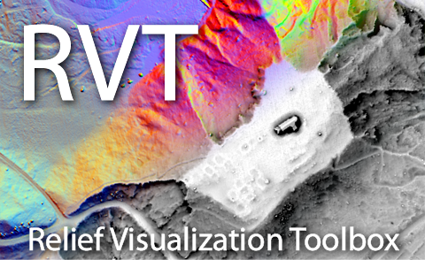

[](https://pypi.org/project/rvt-py/)
[](https://anaconda.org/channels/rvtpy/packages/rvt_py/overview)
[](https://anaconda.org/rvtpy/rvt_py)

# Relief Visualization Toolbox Python library



Relief Visualization Toolbox (RVT) was produced to help scientists visualize raster elevation model datasets. We have narrowed down the selection to include techniques that have proven to be effective for identification of small scale features. The default settings therefore assume working with high resolution digital elevation models derived from airborne laser scanning missions (lidar), however RVT methods can also be used for other purposes.

Sky-view factor, for example, can be efficiently used in numerous studies where digital elevation model visualizations and automatic feature extraction techniques are indispensable, e.g. in geography, archaeology,  geomorphology, cartography, hydrology, glaciology, forestry and disaster management. It can even be used in engineering applications, such as predicting the availability of the GPS signal in urban areas.

Methods currently implemented are:

* hillshading,
* hillshading from multiple directions,
* slope gradient,
* simple local relief model,
* multi-scale relief model,
* sky illumination,
* sky-view factor (as developed by our team),
* anisotropic sky-view factor,
* positive and negative openness,
* local dominance,
* multi-scale topographic position,
* visualization for archaeological topography (VAT),
* combined visualization for archaeological topography (Combined VAT).
* multi-scale topographic position enhanced version 4 (e^4^MSTP).

## RVT for Python

The ``rvt`` Python package contains three modules:

* `rvt.vis` for computing visualizations

* `rvt.blend` for blending visualizations together
  
* ``rvt.default`` for defining default parameters with methods to compute and save visualization functions using set parameters

## References

When using the tools, please cite the following:

*   Zakšek, K., Oštir, K., Kokalj, Ž. 2011. Sky-View Factor as a Relief Visualization Technique. Remote Sensing 3: 398-415.
*   Kokalj, Ž., Zakšek, K., Oštir, K. 2011. Application of Sky-View Factor for the Visualization of Historic Landscape Features in Lidar-Derived Relief Models. Antiquity 85, 327: 263-273.
*   Kokalj, Ž., Somrak, M. 2019. Why Not a Single Image? Combining Visualizations to Facilitate Fieldwork and On-Screen Mapping. Remote Sensing 11(7): 747.


## Installation

RVT requires Python 3.11 or newer. Its runtime dependencies are NumPy, SciPy, GDAL and Matplotlib. GDAL includes native libraries, so Conda is the recommended installation method for most users.

RVT is also available as [custom raster functions for ArcGIS Pro](https://rvt-py.readthedocs.io/en/latest/install_arcgis.html "ArcGIS installation") and as [a QGIS plugin](https://rvt-py.readthedocs.io/en/latest/install_qgis.html "QGIS installation").

### Conda

The current Conda package is published on the [rvtpy channel](https://anaconda.org/rvtpy/rvt_py "rvt_py on Anaconda Cloud"). Create an environment using the RVT channel and conda-forge:

```bash
conda create --name rvt --override-channels --channel conda-forge --channel rvtpy python=3.11 rvt_py
conda activate rvt
```

### PyPI

A standard PyPI installation works when a compatible GDAL native library and its Python bindings are already available:

```bash
python -m pip install rvt-py
```

If GDAL is not already installed, use the Conda method above. You can also let Conda supply the runtime dependencies and install RVT itself from PyPI:

```bash
conda create --name rvt-pip --channel conda-forge python=3.11 gdal numpy scipy matplotlib pip
conda activate rvt-pip
python -m pip install --no-deps rvt-py
```

The `--no-deps` option prevents pip from replacing the packages supplied by Conda.

To run the notebooks and repository examples in a pip-managed environment, install the optional example dependencies:

```bash
python -m pip install "rvt-py[examples]"
```

Verify the installation with:

```bash
python -c "from osgeo import gdal; import rvt; import rvt.vis; import rvt.blend"
```

See the [installation documentation](https://rvt-py.readthedocs.io/en/latest/install_main.html) for more information.

## Documentation
Documentation of the package and its use is available at [Relief Visualization Toolbox in Python documentation](https://rvt-py.readthedocs.io/).

## Contributing
Pull requests are welcome. For major changes, please open an issue first to discuss what you would like to change. Please report any bugs and suggestions for improvements.

## Acknowledgment
Development of RVT Python scripts was part financed by the Slovenian Research Agency core funding No. P2-0406, and by research project No. J6-9395.

## License
This project is licensed under the terms of the [Apache License](LICENSE).

## About
RVT Python library by Žiga Kokalj, Žiga Maroh, Krištof Oštir, Klemen Zakšek and Nejc Čož, 2022.

It is developed in collaboration between ZRC SAZU and University of Ljubljana. 


