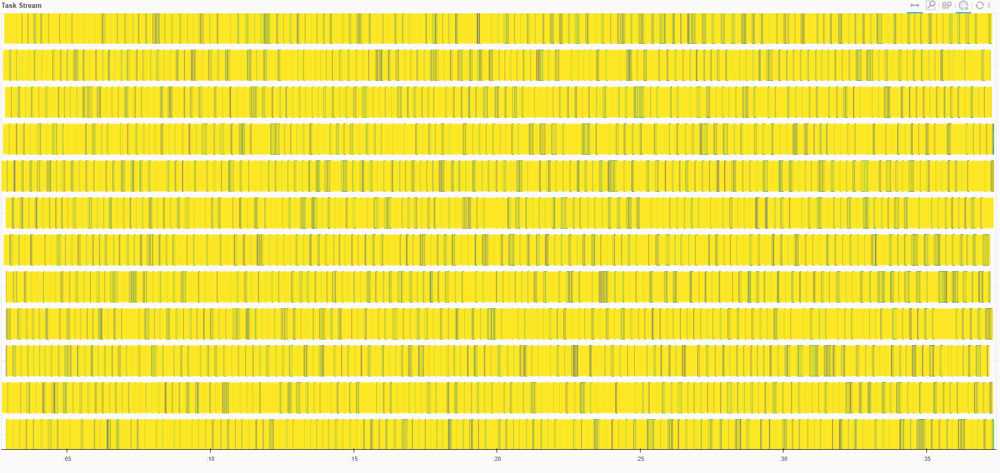
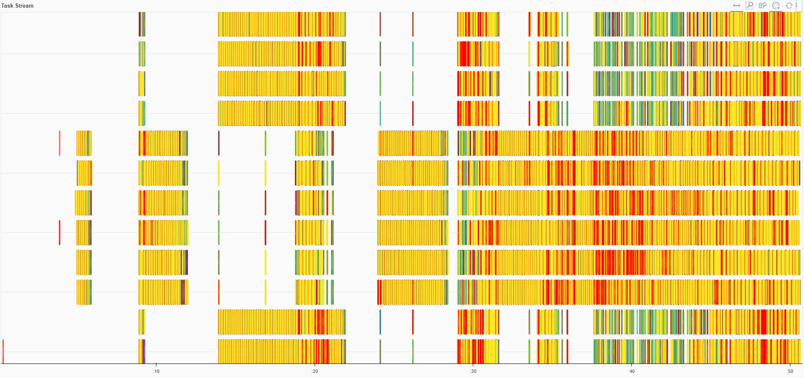
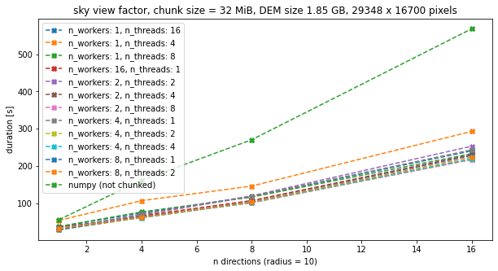
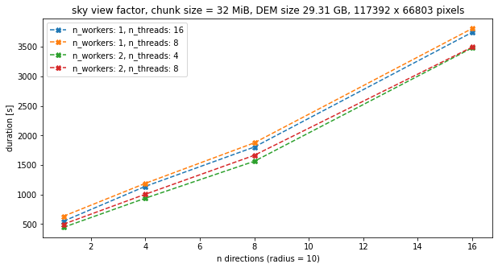

# TODO

This is the markdown todo file for feature/dask branch of Github Repo [RVT_py](https://github.com/EarthObservation/RVT_py).

### Content

* Modify rvt to support parallel processing and streaming computation on rasters that don't fit into memory. 
* Heavy use of dask functions `map_overlap` and `map_blocks`.
* Dask analysis workflow. Generate task graph: 
  * Load raster. 
    * Apply visualization. 
    * Apply normalization. 
    * Apply blending. 
    * Apply rendering. 
    * ... repeat ...
  * Save raster. 
  * Execute tasks by calling .compute() at the end.

* Mapping and chaining of these functions across all dask blocks is done in a same fashion as described in the third section of  [napari tutorials](https://napari.org/tutorials/processing/dask.html). Multiple cycles of visualisation -> normalization -> blending -> rendering restults in long tasks, taking one chunk "from start to finish".\*  

* Aplication of reduction functions on dask array (for example during normalization of the image). This means absolute maximum, minimum or distriburion has to be calculated on the whole dask array (not local/ on numpy chunk). The values are used in some conditional statements in functions applied on numpy chunks (mapped over dask array).
Examples of reduction functions used are: da.nanmin, da.nanmax, da.percentile.\*  

### Todo

- [ ] Dask memory issues
  - [ ] Better memory control and HighLevelGraph task manipulation using `dask.delayed` instead of `dask.array.map_(blocks/overlap)`? In this case overlap has to be handled manually.
  - [x] Get available memory and compute / set memory (GB) per Dask worker. 
  - [ ] Get / compute optimal chunk size.
  - [ ] Compute data too large to fit in memory vs. speed up computation of the image across multiple clusters is different problem.
  - [ ] Number of tasks in not always the same (chaining depends on number of visualization layers). Predict?
- [ ] Input / output (specification)
  - [ ] Is input one single raster (several TB - too big to open/visualize) or already chunked?
  - [ ] Is output one single raster (several TB - too big to open/visualize) or already chunked?
- [ ] Multidimensional (3D) rasters
  - [ ] Fix (`rvt.blend_func.blend_images`) blend mode = "Luminosity". Broken for multiband background arrays. min_c and max_c inputs to `matrix_eq_min_lt_zero` and `matrix_eq_max_gt_one` functions should be np.array. Not int or float.
  - [ ] Fix reduction functions (da.nanmax, da.nanmin,..) for multiband inputs.
  - [ ] Modify mapped functions for multiband inputs.
- [ ] Test dask distribution (da.percentile) calcualted in `lin_cutoff_calc_from_perc` on very large inputs.
- [ ] Fix `rvt.vis.sky_illumination`(np.max -> da.max).


### Done ✓

- [x] Code refactoring of `rvt.blend_func.normalize_image`.
  - [x] Possible issue in `lin_cutoff_calc_from_perc` function (distribution calcualtion). Dask array does not support nanpercentile.
- [x] Wrap exising vis functions and map over dask array with some overlap. 
- [x] Wrap exising blend_func functions and map over dask array. 
- [x] Read (lazy load) raster in chunks.
- [x] Save raster in chunk by chunk (.tif and .zarr). Parallel writes. 
- [x] Read multiband data. 
- [x] Fix numpy runtime errors / suppress warnings (keep, not really relevant).
- [x] Tests for `blend_func_dask.py` and `vis_dask.py`.
- [x] Fix most outter padding in some visualization functions in original `vis.py`.

##### _Notes on Todo and Done (aka confusing mix of different problems, mainly memory issues)_
- [In theory](https://stackoverflow.com/questions/49406987/how-do-we-choose-nthreads-and-nprocs-per-worker-in-dask-distributed), since the workload is mostly numeric and Numpy releases the GIL well, ratio n_threads >> n_processes should be prefered.
- If chunks are too small: huge amount of tasks and a lot of time spent developing the task graph - task scheduler hangs. 
- If chunks are too big: `Exception has occurred: _ArrayMemoryError`, `Unable to allocate xx MiB for an array with shape (dimx, dimy) and data type float32.` [Error encountered.](https://stackoverflow.com/questions/62839068/memoryerror-unable-to-allocate-mib-for-an-array-with-shape-and-data-type-when). Or `MemoryError: Unable to allocate internal buffer.` This happens only with very large rasters (e.g. 30 GB). For example, computation is successful on 2 GB raster with chunk size ranging from 8 MiB to 512 MiB. The same computation on 30 GB raster is successful only for chunk sizes 16 MiB to 64 MiB (without pausing the workers, which increases computation time significantly. Pausing is not always sufficient and workers eventually get overwhelmed and killed). Example of smooth and paused task stream below (Same computation, on the same 30 GB raster, 16 MiB chunks. The only difference is the number of workers and threads per worker. 1 worker & 12 threads in the case of "ok looking" task stream and 2 workers & 6 threads per worker in the case of workers pausing). **TLDR;** Analyse optimal nr. of processes: total computing time = computation time + comunication time (task overhead < 1ms)




Possible issues: Is dask scheduler "too eager" and overcommiting tasks, is computation faster than writing to disk and chunks keep accumulating in memory (issue persists if writing to tif or to zarr), waiting to be written but eventually fail, memory leak, some expensive memory operation (e.g. rechunking in axis = 0 direction when visualizations produce 3D array) in the middle of workflow, is data load faster than it can be computed downstream,..? [Memory issues](https://alimanfoo.github.io/dask/2021/03/22/dask-memory-thought.html). Inspecting _memory by key_ tab on diagnostics dashboard, `concatenate` and `getitem` tasks have by far the highest memory use. Look into how much peak memory each task is using, [RAM/core ratio](https://blog.dask.org/2021/03/11/dask_memory_usage).)
Try tweaking some settings in `distributed.yaml` or `dask.yaml` file for smoother process:
1. `default-task-durations`,❌
2. set target worker  memory fractions to stay below: `target, spil, pause, terminate`,❌
3. set `MALLOC_TRIM_THRESHOLD_` to trim unmanaged memory (only works on linux os),❌
4. change `optimization.fuse.ave-width` (to fuse neighbouring tasks together). ❌

Additionally, try improving [graph serialization](https://docs.dask.org/en/latest/phases-of-computation.html):
1. read data in as a task instead of include it directly (queue?),
2. pre-scatter large data,
3. wrap in dask.delayed,
4. ~~possible leak on Local Cluster, revert to dask version [2022.01.1](https://github.com/dask/distributed/issues/5960).❌~~
- Raster datasets are usually stored in blocks (tiles). It is better to  make dask chunks **N * original tile dimensions** to avoid bringing up more data than is needed each time the data is accesed. If `chunks = True` when loading data with `rioxarray.open_rasterio ` automatic chunkig is done in a way that takes into account default tiling and **N** is determined in a way that each chunk size is 128MiB (_Dask default, better performance and higher success/failed to finish ratio was recorded with smaller chunk size, but it depends on the hardware and data size...scalability?_). Set chunk size `dask.config.set({"array.chunk-size": limit})`. 
Graphs below were generated as results of computations with dask distributed, running Local Cluster on a machine with total of 32 GB RAM (`psutil.virtual_memory().total = 32 GB`) and 16 cores (`sum(client.ncores().values()) = 16`). Aprox. 64 MiB equals chunk of size (4096, 4096) = 32 * (128, 128).


 

All `dask` resuslts in comparison with pure `numpy` calculation. This is cca. 2 GB size raster and fits in RAM. 
 

Sky view factor results for calcualtion on 30 GB raster that doesn't fit in RAM,
 


- Tricky to determine. It may seem from the plot above that the optimal chunk size is somewhere between 32 MiB and 64 MiB. However, results differ if file is larger (e.g. 30 GB) and/or task of taking single chunk "from start to finish" is longer (e.g. calculating single visualization vs. calcaulating combinations with multiple layers). See possible memory issues above. Apply some sort of queue to limit chunks or tasks being processed at the same time, for smoother processing/without pausing (and crashing) workers so much? Why is there such a difference in processing 2 GB vs 30 GB file with same chunksizes and worker/threads ratios?
- Visualization `(dask)_multi_hillshade` (if saving directly from `vis.py`) results is very large (chunk depth and final) output of file size: _nr_directions * original raster file size_. Calculation in each direction is additional raster band.
- Metadata and the file naming convention when reading _.tif_ raster with `rioxarray.open_rasterio`. Understanding how the data is structured (e.g. assumes dims[1:] are named 'x' and 'y'. Name(s) of the bands (not always the same)? Indexing position always true (e.g. `dims[0]= 'band'`, `dims[1] = 'y'`, `dims[2] = 'x'`)?
- How are [no_data values](https://corteva.github.io/rioxarray/stable/getting_started/nodata_management.html) represented (no_data = data_set.rio.nodata, no_data = data_set.rio.encoded_nodata)? When saving to 8-bit `Error: Python int too large to convert to C long`. Temporary exclude copying attributes from orignal to saved dataset. Fix later. [Issue](https://github.com/corteva/rioxarray/issues/113).
- Runtime Warnings encountered:
  - `RuntimeWarning: All-NaN slice encountered if np.nanmin(image_chunk) < 0 or np.nanmax(image_chunk) > 1`
  - `RuntimeWarning: overflow encountered in long_scalars maxsize = math.ceil(nbytes / (other_numel * itemsize))`
  - `RuntimeWarning: overflow encountered in square tan_slope = np.sqrt(dzdx ** 2 + dzdy ** 2)`
- [Scaling](https://www.jennakwon.page/2021/03/benchmarks-dask-distributed-vs-ray-for.html). [Adaptivity](https://github.com/dask/distributed/issues/4471). 
- LocalCluster vs. for example PBSCluster. When running on HPC better adaptive dynamic scaling of workers? [Dask jobqueue](https://jobqueue.dask.org/en/latest/) can adapt the cluster size dynamically based on current load. Helps to scale up the cluster when necessary but scale it down and save resources when not actively computing. 
- [Benchmarks](https://matthewrocklin.com/blog/work/2017/07/03/scaling).
- When reading/ writing very large arrays to .tif  sometimes error (random, hard to reproduce): `RasterioIOError: file used by other process` followed by `distributed.worker - WARNING - Compute Failed`. Current workaround (BAD!) to avoid computation failure is to catch the exception in `rasterio.__init__.py", line 230, in open`, wait for 5 s and try to acquire the lock again. Change the lines 230 - 232 to (first try without this and see if error comes up, it is not ideal to make changes in  rasterio module; `rasterio-1.2.10`). Also `to_zarr` works fine, so look more into this, when final desired output is defined (format, chunks saved separately,..wait for specification of what final output should be):

```diff
- s = get_writer_for_path(path, driver=driver)(
-  path, mode, driver=driver, sharing=sharing, **kwargs
-  )
+ try:
+     s = get_writer_for_path(path, driver=driver)(
+     path, mode, driver=driver, sharing=sharing, **kwargs
+     )
+ except Exception as ex:
+     #print("!!EXCEPTION OCCURRED!!")
+     print(str(ex))
+     import time
+     time.sleep(5)
+     s = get_writer_for_path(path, driver=driver)(
+     path, mode, driver=driver, sharing=sharing, **kwargs
+     )
```
