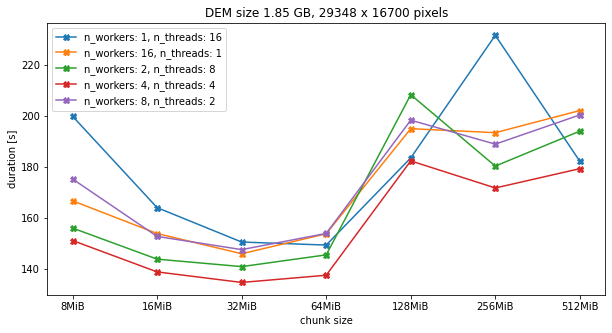

# TODO

This is the markdown todo file for feature/dask branch of Github Repo [RVT_py](https://github.com/EarthObservation/RVT_py).

### Content

* Modify rvt to support parallel processing and streaming computation on rasters that don't fit into memory. 
* Heavy use of dask functions `map_overlap` and `map_blocks`.
* Dask analysis workflow. Generate task graph: 
  * Load raster. 
    * Apply visualization. 
    * Apply normalization. 
    * Apply blending. 
    * Apply rendering. 
    * ... repeat ...
  * Save raster. 
  * Execute tasks by calling .compute() at the end.

* Mapping and chaining of these functions across all dask blocks is done in a same fashion as described in the third section of  [napari tutorials](https://napari.org/tutorials/processing/dask.html). Multiple cycles of visualisation -> normalization -> blending -> rendering restults in long tasks, taking one chunk "from start to finish".\*  

\*With [large inputs](https://github.com/dask/dask/issues/3514) takes a long time to start calculation (Is there a more efficient way of saying "this input chunk should map to this output chunk"?)

### Todo

- [ ] Additional code refactoring. 
- [ ] Dask memory issues.
  - [ ] Get available memory and compute / set memory (GB) per Dask worker. 
  - [ ] Get / compute optimal chunk size. 
- [ ] Fix most outter padding in some visualization functions in original `vis.py`.

### In Progress

- [ ] Work on restoring some of the previously existing non-dask functionality - keep both options.
- [ ] Fix numpy runtime errors / suppress warnings.
- [ ] Additional testing of visualization functions (writing and reading raster data.)
- [ ] Fix failing test with multiband (`rvt.blend_func.blend_images`) blend mode =  "Luminosity".

### Done ✓

- [x] Wrap exising vis functions and map over dask array with some overlap. 
- [x] Wrap exising blend_func functions and map over dask array. 
- [x] Read (lazy load) raster in chunks.
- [x] Save raster in chunk by chunk (.tif and .zarr). Parallel writes. 
- [x] Read multiband data. 

##### _Notes on Todo and Done_
- If chunks are too small: huge amount of tasks and a lot of time spent developing the task graph - task scheduler hangs.
- If chunks are too big:  _"Unable to allocate XX MiB for an array with shape (dimx, dimy) and data type float32."_ [Error encountered.](https://stackoverflow.com/questions/62839068/memoryerror-unable-to-allocate-mib-for-an-array-with-shape-and-data-type-when) 
- Raster datasets are usually stored in blocks (tiles). It is better to  make dask chunks **N * original tile dimensions** to avoid bringing up more data than is needed each time the data is accesed. If `chunks = True` when loading data with `rioxarray.open_rasterio ` automatic chunkig is done in a way that takes into account default tiling and **N** is determined in a way that each chunk size is 128MiB (_Dask default, better performance and higher success/failed to finish ratio was recorded with smaller chunk size, but it depends on the hardware and data size...scalability?_). Set chunk size `dask.config.set({"array.chunk-size": limit})`. Graph below was generated on a machine with total of 32 GB RAM (`psutil.virtual_memory().total = 32 GB`) and 16 cores (`sum(client.ncores().values()) = 16`). Aprox. 64 MiB equals chunk of size (4096, 4096) = 32 * (128, 128).

- Can't replicate entire graph above running `VAT_combined_(dask).py` on very large rasters (e.g. 30 GB). [Problems](https://github.com/dask/distributed/issues/2602) if chunks are bigger and/or number of workers is higher. Data load is faster than it can be computed downstream, eventually overwhelming workers, causing them to run out of memory and crash. Apply some sort of queue to limit chunks or tasks being processed at the same time?
- If overlap depth is greater than any chunk along a particular axis, then the array is rechunked -> Strange behavior, may result in error at blending step.
- _Multi_hillshade_ (if saving directly from `vis.py`)results is very large (chunk depth and final) output of file size: _nr_directions * original raster file size_. Calculation in each direction is additional raster band.
- Metadata and the file naming convention when reading _.tif_ raster with `rioxarray.open_rasterio`. Understanding how the data is structured (e.g. assumes dims[1:] are named 'x' and 'y'. Name(s) of the bands (not always the same)? Indexing position always true (e.g. `dims[0]= 'band'`, `dims[1] = 'y'`, `dims[2] = 'x'`)?
- How are [no_data values](https://corteva.github.io/rioxarray/stable/getting_started/nodata_management.html) represented (no_data = data_set.rio.nodata, no_data = data_set.rio.encoded_nodata)? When saving to 8-bit `Error: Python int too large to convert to C long`. Temporary exclude copying attributes from orignal to saved dataset. Fix later. [Issue](https://github.com/corteva/rioxarray/issues/113).
- Runtime Warnings encountered:
  - `RuntimeWarning: All-NaN slice encountered if np.nanmin(image_chunk) < 0 or np.nanmax(image_chunk) > 1`
  - `RuntimeWarning: overflow encountered in long_scalars maxsize = math.ceil(nbytes / (other_numel * itemsize))`
  - `RuntimeWarning: overflow encountered in square tan_slope = np.sqrt(dzdx ** 2 + dzdy ** 2)`
- [Scaling](https://www.jennakwon.page/2021/03/benchmarks-dask-distributed-vs-ray-for.html).
- [Benchmarks](https://matthewrocklin.com/blog/work/2017/07/03/scaling).
- When writing to .tif sometimes error (random, can't reproduce): `error File "rasterio\_io.pyx", line 1189, in rasterio._io.DatasetWriterBase.__init__ rasterio.errors.RasterioIOError: file_to_store.tif: file used by other process distributed.worker - WARNING - Compute Failed`