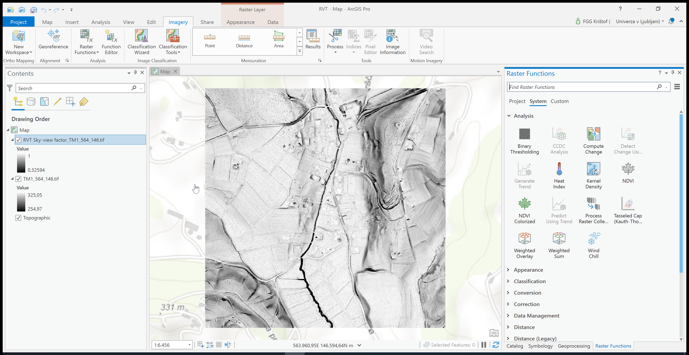

.. _arcgis:

ArcGIS Pro
==========

Relief Visualisation Toolbox can be used in ArcGIS Pro as Raster Functions.

As described in `Raster functions—ArcGIS Pro | Documentation <https://pro.arcgis.com/en/pro-app/help/data/imagery/raster-functions.htm>`_, raster functions are operations that apply processing directly to the pixels of imagery and raster datasets, as opposed to geoprocessing tools, which write out a new raster to disk. Calculations are applied to the pixels of the original data as displayed, so only pixels that are visible on your screen are processed. As you zoom and/or pan around, the calculations are performed on the fly. Because no intermediate datasets are created, processes can be applied quickly, as opposed to the time it would take to create a processed file on disk.

If you would like to use use Relief Visualization Toolbox in ArcGIS Pro, you have to activate each function individually.

#. Select ``Imagery → Raster Functions``

   .. image:: ./figures/rvt_esri_ribbon.png

#. Select ``≡ → Open Python Raster Function``.

   .. image:: ./figures/rvt_esri_toolbox.png

#. Then select the Python Module ``rvt_esri_*.py`` and Class Name (there is only one class in every function).

   .. image:: ./figures/rvt_esri_open.png

#. Set the function parameters in the toolbox.

   .. image:: ./figures/rvt_esri_menu.png

#. Click ``Create new layer``

The result is computed and displayed in the viewer.

The modules are the same as described in :ref:`usage`.

