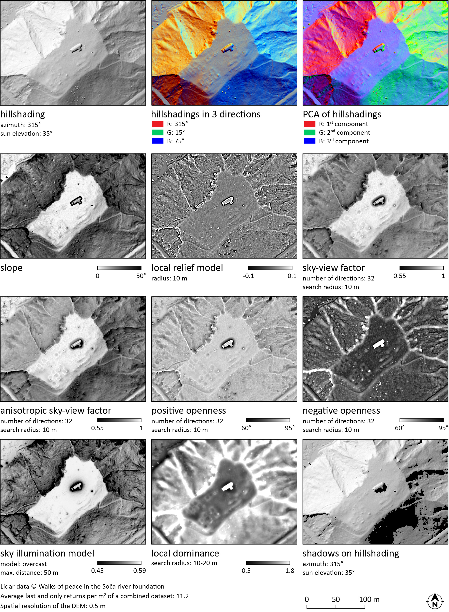

.. # Relief Visualization Toolbox in Python documentation master file, created by
   sphinx-quickstart on Mon Oct 12 08:11:32 2020.
   You can adapt this file completely to your liking, but it should at least
   contain the root `toctree` directive.

Relief Visualization Toolbox
============================

Relief Visualization Toolbox was produced to help scientists visualize raster elevation model datasets. We have narrowed down the selection to include techniques that have proven to be effective for identification of small scale features. The default settings therefore assume working with high resolution digital elevation models derived from airborne laser scanning missions (lidar), however methods from the Relief Visualization Toolbox can also be used for other purposes. 

Sky-view factor, for example, can be efficiently used in numerous studies where digital elevation model visualizations and automatic feature extraction techniques are indispensable, e.g. in geography, archaeology,  geomorphology, cartography, hydrology, glaciology, forestry and disaster management. It can even be used in engineering applications, such as predicting the availability of the GPS signal in urban areas.

Methods currently implemented are:

*   hillshading
*   hillshading from multiple directions
*   slope gradient
*   simple local relief model
*   multi-scale relief model
*   sky illumination
*   sky-view factor (as developed by our team)
*   anisotropic sky-view factor
*   positive and negative openness
*   local dominance

References
----------

When using the tools, please cite:

*   Kokalj, Ž., Somrak, M. 2019. `Why Not a Single Image? Combining Visualizations to Facilitate Fieldwork and On-Screen Mapping <https://www.mdpi.com/2072-4292/11/7/747>`_. Remote Sensing 11(7): 747.
*   Zakšek, K., Oštir, K., Kokalj, Ž. 2011. `Sky-View Factor as a Relief Visualization Technique <https://www.mdpi.com/2072-4292/3/2/398>`_. Remote Sensing 3: 398-415.
*   Kokalj, Ž., Zakšek, K., Oštir, K. 2011. `Application of Sky-View Factor for the Visualization of Historic Landscape Features in Lidar-Derived Relief Models <https://www.cambridge.org/core/journals/antiquity/article/application-of-skyview-factor-for-the-visualisation-of-historic-landscape-features-in-lidarderived-relief-models/653F5AE9086CE2028974934C3BBDC104>`_. Antiquity 85, 327: 263-273.

Further reading
---------------

*   Kokalj, Žiga, Ralf Hesse. 2017. `Airborne laser scanning raster data visualization: A Guide to Good Practice <https://omp.zrc-sazu.si/zalozba/catalog/book/824>`_. Ljubljana: Založba ZRC. (a comparative guide describing each method)

Contributing
------------

The project source code is available at `GitHub <https://github.com/EarthObservation/RVT_py>`_. Pull requests are welcome. For major changes, please open an issue first to discuss what you would like to change.

Please report any bugs and suggestions for improvements.

Acknowledgment
--------------

Development of RVT was part financed by the European Commission's Culture Programme through the ArchaeoLandscapes Europe project and by the Slovenian Research Agency core funding No. P2-0406, and by research projects No. J2-9251, No. J6-7085 and No. J6-9395.

Development of RVT QGIS plugin was part financed by PTS Consultancy via the UK Government Culture Recovery Fund.

License
-------

This project is licensed under the terms of the `Apache License <http://www.apache.org/licenses/LICENSE-2.0>`_.

© Copyright 2010-2021 ZRC SAZU and University of Ljubljana

.. toctree::
   :hidden:
   
   install_main
   listofvis
   start_main
   rvtfor_python
   rvtfor_arcgis
   rvtfor_qgis
   examples
   releases_main
   bibliography
