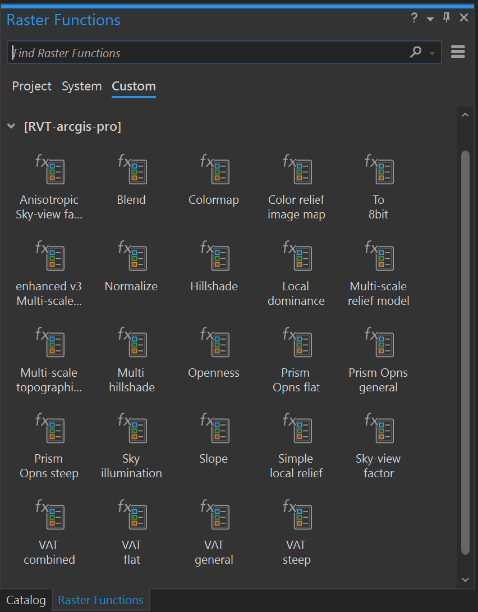

.. _install_arcgis:

ArcGIS installation
===================

To use RVT in ArcGIS Pro, `download the ArcGIS Raster Functions repository <https://github.com/EarthObservation/rvt-arcgis-pro>`_ by selecting ``Code → Download ZIP``.

Unzip the downloaded repository folder and *rename* it to ``rvt-arcgis-pro``, then copy the whole repository folder to: ``<ArcGIS Pro install path>/Resources/Raster/Functions/Custom``

Usually the path is: ``c:/Program Files/ArcGIS/Pro/Resources/Raster/Functions/Custom``

For ArcGIS Server use, copy the whole repository folder (``rvt-arcgis-pro``) to every federated server machine of your enterprise setup: ``<ArcGIS Server install path>/framework/runtime/ArcGIS/Resources/Raster/Functions/Custom``

Open or restart ArcGIS Pro. Select ``Imagery → Raster Functions`` to open the Raster Functions pane. 

In the ``Raster Functions`` pane, select the ``Custom`` tab to access the ``rvt-arcgis-pro`` group containing the raster functions.

