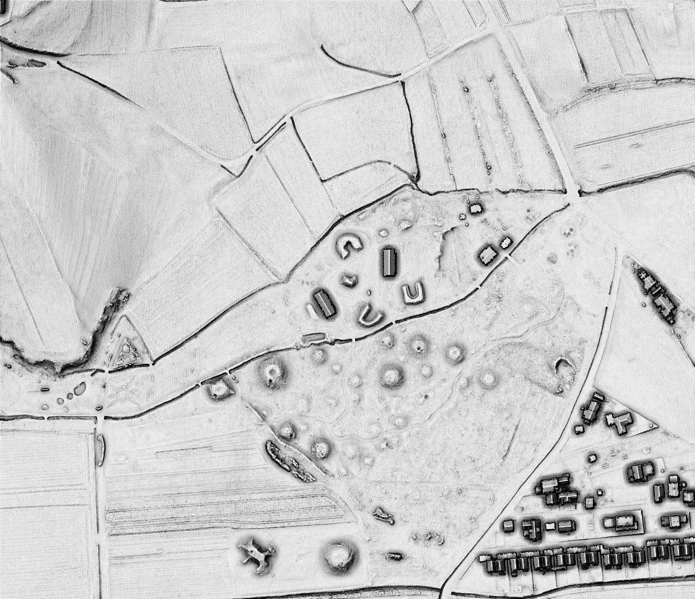
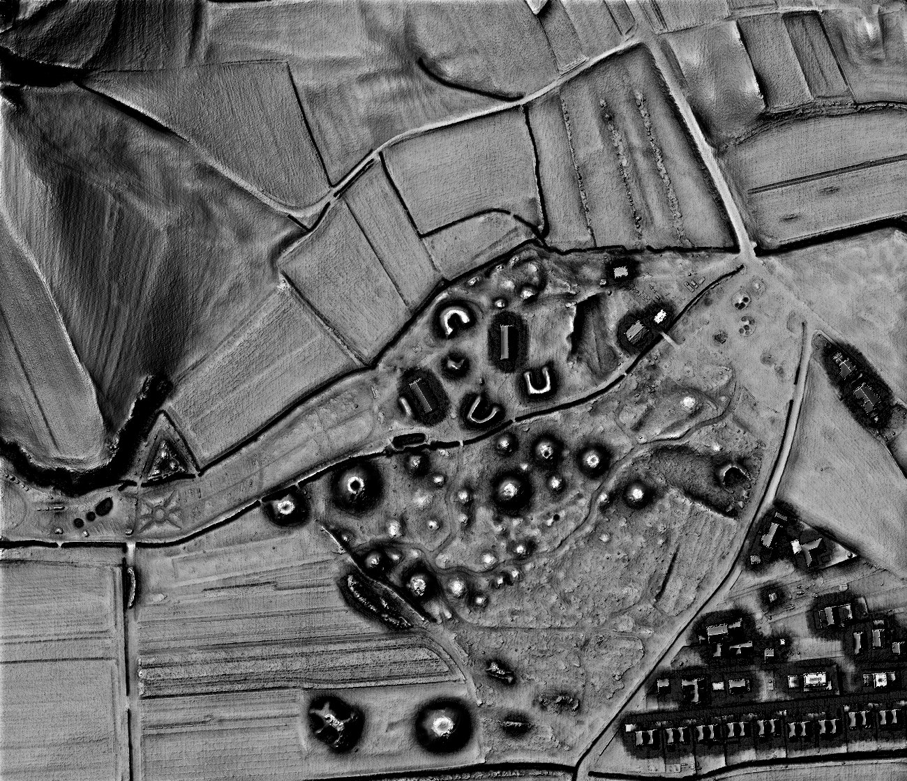
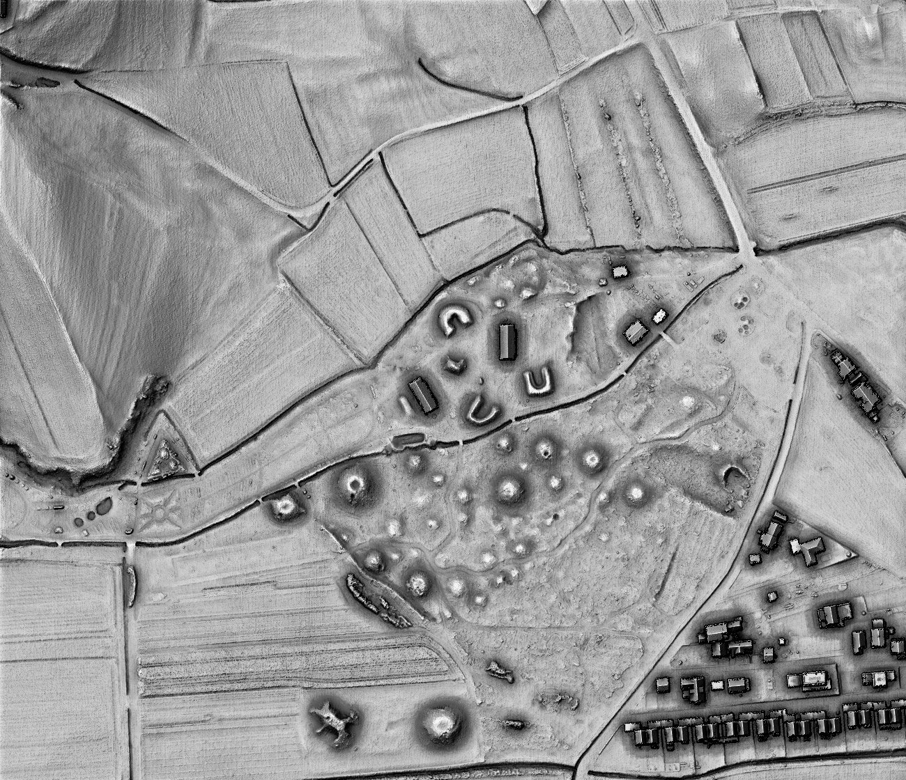

.. _listofvis_VAT:

Visualisation for Archaeological Topography (VAT)
========

Visualisation for archaeological topography (VAT) computed with settings for general terrain.

Visualisation for archaeological topography (VAT) computed with settings for flat terrain.

Visualisation for archaeological topography (VAT) is intuitive and easy to interpret, does not depend on the orientation or shape of small topographic features, ‘works well’ in all terrain types, and does not create artifacts. It is based on fusing four information layers into a single image (hillshade, slope, positive openness, and sky-view factor) (`Kokalj and Somrak 2019 <https://doi.org/10.3390/rs11070747>`_). VAT can enhance the visibility of features of varied scale, height, orientation, and form on terrain ranging from extremely flat to very steep.

The default (general) computation settings are used to visualise a diverse landscape with high mountains and plains. However, the result fails to portray the broader, subtle features of flat terrain. On the other hand, VAT computed with settings for flat terrain makes such structures very distinct but can become oversaturated in areas with very steep slopes.

Combined visualisation for archaeological topography
--------

Combined visualisation for archaeological topography (combined VAT or CVAT) blends results computed with settings for general and flat terrain. Combined VAT is a very suitable ‘base’ visualisation that can be fused with other techniques to add additional information in the form of colors. It is comparable across diverse areas and is a suitable technique for archaeological mapping using lidar data derivatives.

We recommend replacing hillshading and many other techniques in scientific and technical literature with combined VAT because it offers all the benefits – it is easy to understand and works well as a background – but provides much more detail. When less contrast is desired, e.g., when combined with very detailed vector layers showing a high density of features, VAT computed with a setting for general terrain is a good choice for a base map (`Kokalj 2025 <https://doi.org/10.1002/arp.70002>`_).

Source:

*   Kokalj, Ž. in M. Somrak. 2019. `Why not a single image? Combining visualizations to facilitate fieldwork and on-Screen mapping <https://doi.org/10.3390/rs11070747>`_. Remote Sensing 11 (7): 747. 
*   Kokalj, Ž. 2025. `Standardizing visualization in ancient Maya lidar research: Techniques, challenges and recommendations <https://doi.org/10.1002/arp.70002>`_. Archaeological Prospection 32(4): 967-988.

