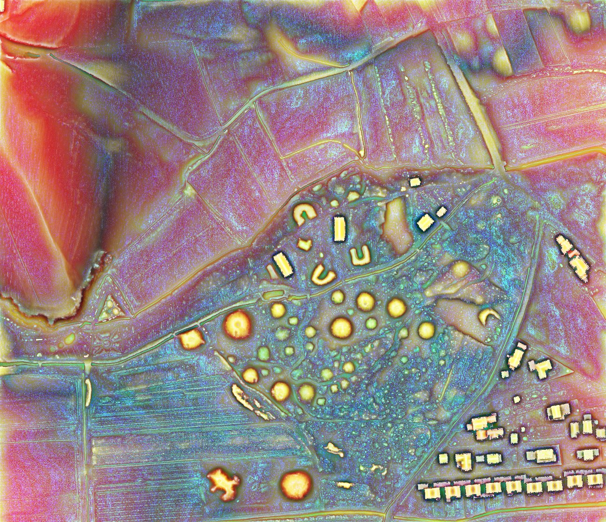
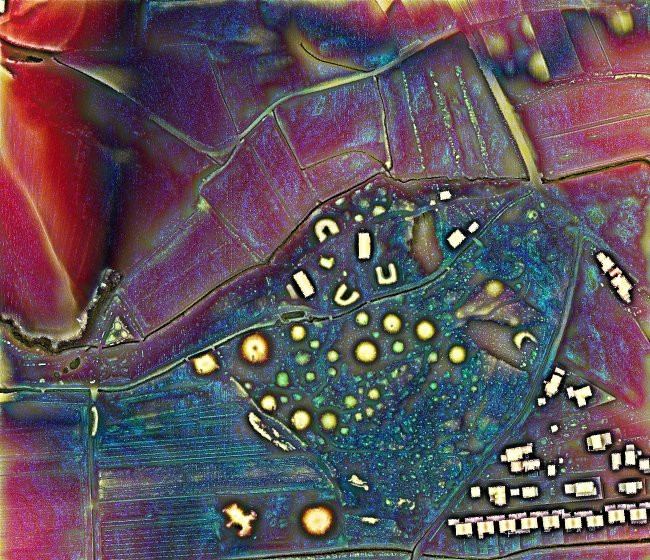

.. _listofvis_emstp:

Enhanced multi-scale topographic position (eMSTP)
========

Guyot et al. (2021) introduced the second version (e2MSTP), which fuses multi-scale topographic position (MSTP) with simple local relief model (SLRM) and red relief image map (RRIM). The latter is patented in some countries, and thus introduces uncertainty regarding patent status. To avoid infringement, the third enhanced version (e3MSTP), implemented in the RVT Python functions, replaces the RRIM with colored relief image map (CRIM) (Maroh 2021). The color combinations take time to become familiar with, but allow for better recognition of topographical features of various scales.

Version 4 (e4MSTP) combines the red-toned slope with a combination of positive and negative openness and local dominance, merged sky view factors computed with two different radii and histogram stretches, and MSTP (see Table A.1). This version is exceptional at showing small variations in topography in flat terrain, as well as at showing small structures. If colors are distracting, they can be removed by displaying (e4MSTP) with a luminosity blend mode (Kokalj 2025).

Source:

*   Maroh, Ž. 2021. Methods for the Visualization of Digital Elevation Model with ArcGIS Pro Raster Functions. Master Thesis, University of Ljubljana: Ljubljana.
*   Kokalj, Ž. 2025. `Standardizing visualization in ancient Maya lidar research: Techniques, challenges and recommendations <https://doi.org/10.1002/arp.70002>`_. Archaeological Prospection 32(4): 967-988.
