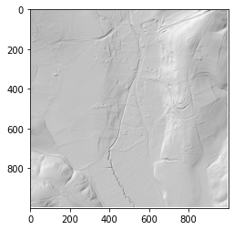

.. _listofvis_hillshade:

Hillshading
===========

Hillshading (also known as relief shading or shaded relief) provides the most ‘natural’, i.e. intuitively readable, visual impression of all techniques. 

It has a basic assumption that the relief is a Lambertian surface (equally bright from all viewing directions) illuminated by direct light from a fictive light source at an infinitive distance. The light beam has a constant azimuth and elevation angle for the entire area.

Applying several illumination directions can help to avoid the drawbacks of shaded relief, such as poor representation of linear features parallel to illumination azimuth, low contrast in areas facing towards (homogeneously bright) or away from (homogeneously dark) the light source, as well as optical illusions (e.g. inverted relief).

While very low illumination elevation angles (< 10°) can and should be used to highlight low relief features in areas of low slopes and flat terrain, higher illumination elevation angles (> 35°) are required in steeper topography. 

To investigate features on moderate to steep slopes, shaded relief should be used with (almost) vertical illumination to minimize saturated bright/dark areas on slopes facing towards/away from the illumination. In such cases, shaded relief images become similar to :ref:`listofvis_slope` images, which can be a useful alternative in moderate to steep topography.

Multiple direction hillshading
------------------------------

   .. image:: ./figures/rvtvis_multihillshade.png

Producing multiple hillshading outputs by illuminating a surface from multiple directions enhances the visualization of topography. 

Multi-directional hillshading reduces the need to compare multiple images, but the added complexity means they can be tricky to interpret. A step towards an improved understanding of the results is combining multiple shadings by considering only the mean, the maximum, or the range of values, for each pixel.