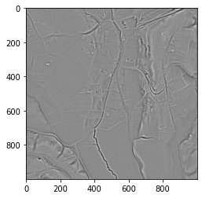

.. _listofvis_msrm:

Multi-scale relief model (MSRM)
===============================

Multi-scale relief model (MSRM) was developed to extract micro-topographic information at various scales. Computing MSRM involves applying multiple low-pass filters to the original DEM using a range of kernel radii. Ideally, these radii should span the full spectrum of sizes corresponding to potential features of interest. The algorithm then computes the differences between successive low-pass–filtered surfaces and derives the final multiscale relief by averaging these differential relief layers.

Source: Orengo, H. A., Petrie, C. A. 2018. `Multi-scale relief model (MSRM): a new algorithm for the visualization of subtle topographic change of variable size in digital elevation models <https://onlinelibrary.wiley.com/doi/full/10.1002/esp.4317>`_. Earth Surface Processes and Landforms, 43: 1361–1369.
