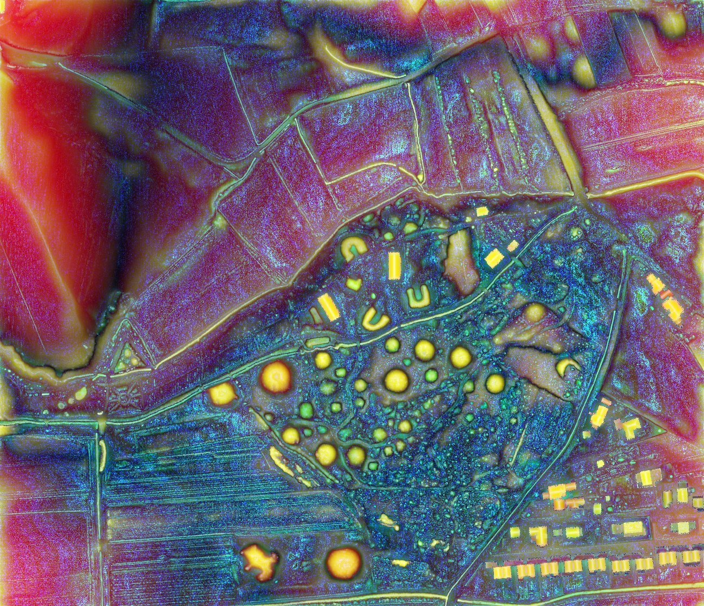

.. _listofvis_msrm:

Multi-scale topographic position (MSTP)
================================

A multi-scale topographic position (MSTP) is generated from a hyperscale datacube of the topographic metric deviation from mean elevation (SLRM) computed with various search radius parameters and reduced to three dimensions by extracting the absolute maximum value from micro-, meso-, and macro-scale ranges, written as a three band (RGB) raster.

Some practice is required to train the eye to recognize colors as the summation of relative topographic position across three scale ranges, rather than, for example, as the raw elevation observed in a DEM. Colours do not have a unique meaning – the same color range can represent a slightly raised embankment or a very shallow dip. Therefore, additional information is needed to distinguish between concave and convex features.

Source: Lindsay, Cockburn, Russell 2015. `An integral image approach to performing multi-scale topographic position analysis <https://www.sciencedirect.com/science/article/pii/S0169555X15300076?via%3Dihub>`_.
