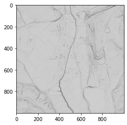

.. _listofvis_openness:

Prismatic openness
========

Prismatic openness was developed to facilitate detection of small structures by Canuto et al. (2018).

.. seealso:: :ref:`listofvis_openness`.

Source:
* Verbovšek, Timotej, Tomislav Popit, and Žiga Kokalj. 2019. “VAT Method for Visualization of Mass Movement Features: An Alternative to Hillshaded DEM. 'Remote Sensing 11 (24): 2946. <https://doi.org/10.3390/rs11242946.>'_
* Canuto, Marcello A., Francisco Estrada-Belli, Thomas G. Garrison, et al. (2018), Ancient Lowland Maya Complexity as Revealed by Airborne Laser Scanning of Northern Guatemala. 'Science 361'<https://doi.org/10.1126/science.aau0137>_ (6409): eaau0137