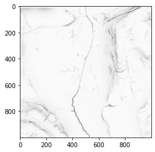

.. _listofvis_skyillum:

Sky illumination
================

Sky illumination models quantitatively represent natural luminance of the sky under various atmospheric conditions. 

Uniform and overcast sky models are implemented as they both disregard directional shadowing effects. Mode details in shadows can be seen using the overcast sky model. 

Calculations last much longer than for other visualizations especially with large maximum shadow modelling distance.

Source: `Relief RVTVisualization Toolbox ver. 2.2.1 Manual <https://www.zrc-sazu.si/sites/default/files/rvt_2.2.1_0.pdf>`_