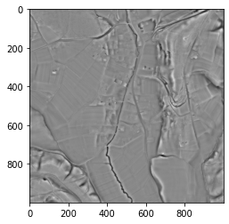

.. _listofvis_slrm:

Simple local relief model
=========================

Simple local relief models use a procedure called trend removal that separates local small-scale features from large-scale landscape forms. 

When working with a DEM, the trend (i.e. the larger landscape forms) is represented by a smoothed (generalized) version of that DEM. Trend removal is then accomplished by subtracting the smoothed DEM from the  original DEM. The resulting difference map contains only the local deviations from the overall landscape forms. 

In areas with flat or very gentle to moderate topography, local relief model and local dominance are very helpful to highlight very low relief features such as former field boundaries or levelled burial mounds.

Local relief model and local dominance are interchangeable to a certain extent. Local relief model produces more realistic relative elevation values of relief anomalies. Local dominance retains a (limited) visual impression of the overall landscape forms as it produces higher values on slopes than on horizontal planes.

.. seealso:: :ref:`listofvis_localdom`.