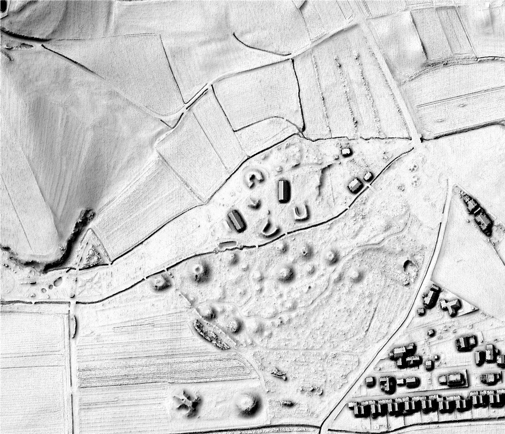

.. _listofvis_svf:

Sky-view factor
===============

.. image:: ./figures/rvtvis_qgis_Pivola_dem_05m_SVF_R10_D16_8bit.jpg
   :width: 650px

Sky-view factor (SVF) can be used as an alternative method of relief shading in order to overcome the directional problems of hillshading (see also: openness).

SVF represents the portion of the sky visible from a certain point. An imaginary light source illuminates the relief from the celestial hemisphere centred at the point being illuminated. It ignores any direction below the mathematical horizon (see also: openness). In contrast to shading techniques based on directional illumination, features visualized by SVF (or by openness) do not contain any horizontal displacements.

In areas of moderate to steep topography, sky-view factor works best to highlight surface depressions and features on slopes. Depending on the range of slopes in a given area under study, different histogram stretches may be necessary to avoid bright saturation in gentle topography and dark saturation on steep slopes. 

In areas with flat or very gentle topography, sky-view factor is generally limited to the presentation of negative relief features (e.g. pits, ditches, quarries, erosion areas, dolines) and becomes very sensitive to DEM noise. A good general rule is to use a histogram stretch of 0.65 to 1.0 for diverse terrain and 0.9 to 1.0 for very flat terrain.

Anisotropic sky-view factor
---------------------------

Anisotropic (directional) SVF assumes that the sky is brighter in some directions than in others. The brightness can depend on the azimuth and solar distance from the imaginary light source. This brings back some of the ‘plasticity’ of hill shading and gives better details on very flat areas.

.. seealso:: :ref:`listofvis_openness`.
